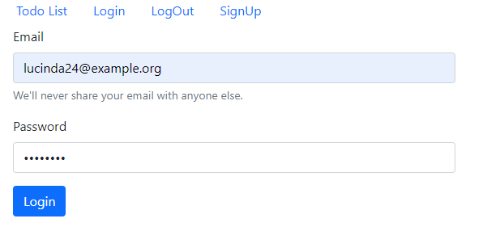
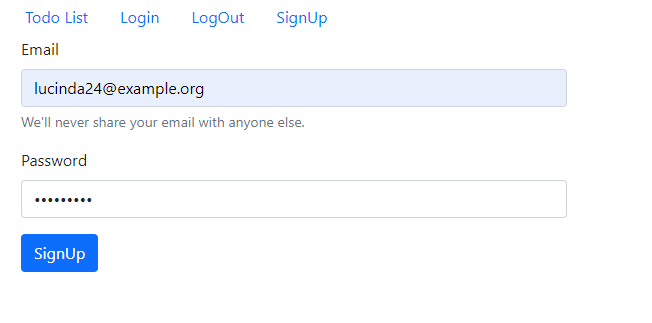
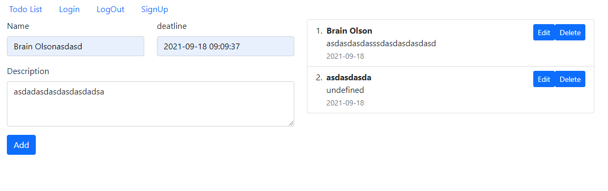
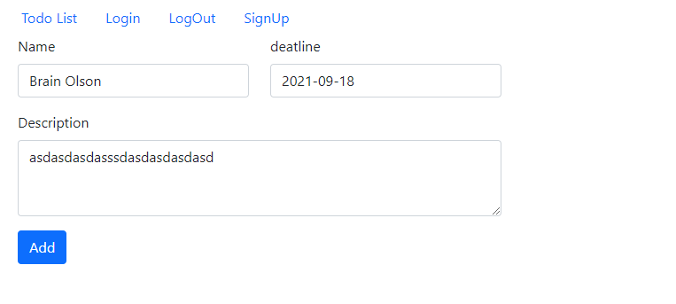

# Guide
## Installation
 ### Instruction 
 1. clone the project
 2. than the name of the api/.env.example file to .env
 3. cofigur database
 4. make sure you can access database
 
 ### comand Line Code for api project
 > composer install   
 > php artisan key:generate  
 > php artisan migrate --seed  
 

 ### comand Line Code for app project
 > npm install
   
## Run
 ### Instruction 
 1. navigate to api folder
 2. open it in cmd
 3. run `php artisan serve`
 4. navigate to app folder
 5. open it in cmd
 6. run `npm start`

### Login information
take any email from the users table and use `password` as password to login

# Preview
## Login Page

## Signup Page

## List Page

## Edit Page

